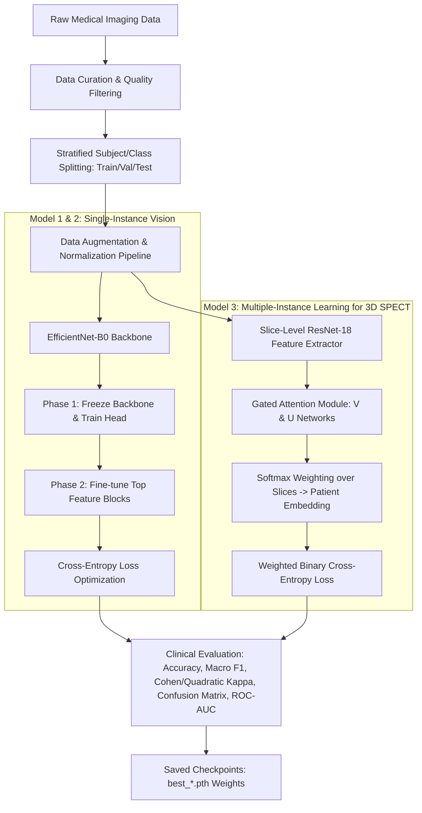

# 🩺 Image Classification Models: Training Methodology & Technical Architecture Guide

This comprehensive guide details the exact end-to-end methodology, deep learning architectures, preprocessing pipelines, training dynamics, and clinical validation protocols used to train the image classification models in this project.

---

## 📑 Table of Contents
1. [Executive Overview & Comparison Table](#1-executive-overview--comparison-table)
2. [High-Level Machine Learning Pipeline](#2-high-level-machine-learning-pipeline)
3. [Model 1: Diabetic Retinopathy Classification (Eye Fundus Images)](#3-model-1-diabetic-retinopathy-classification-eye-fundus-images)
4. [Model 2: Alzheimer's Disease Staging (Brain MRI Scans)](#4-model-2-alzheimers-disease-staging-brain-mri-scans)
5. [Model 3: Parkinson's Disease Detection (DaTscan SPECT & Attention-MIL)](#5-model-3-parkinsons-disease-detection-datscan-spect--attention-mil)
6. [Key Engineering & Methodological Decisions](#6-key-engineering--methodological-decisions)
7. [Supervisor Defense & Q&A Preparation Cheat Sheet](#7-supervisor-defense--qa-preparation-cheat-sheet)

---

## 1. Executive Overview & Comparison Table

The project features **three specialized medical computer vision models**, each tailored to the unique clinical properties of its medical imaging modality:

| Parameter | 👁️ Diabetic Retinopathy | 🧠 Alzheimer's Disease | 🔬 Parkinson's Disease |
| :--- | :--- | :--- | :--- |
| **Image Modality** | Digital Color Retinal Fundus Photography | Axial Structural Brain MRI Scans | 3D Dopamine Transporter (DaTscan) SPECT Scans |
| **Input Shape** | $(3, 224, 224)$ | $(3, 224, 224)$ | Bag of Slices: $(N, 3, 224, 224)$ ($N \le 32$) |
| **Target Task** | 5-Class Ordinal Disease Staging | 4-Stage Cognitive Impairment | Binary Subject-Level Diagnosis (PD vs. Non-PD) |
| **Classes** | `No DR`, `Mild`, `Moderate`, `Severe`, `Proliferate DR` | `NonDemented`, `VeryMildDemented`, `MildDemented`, `ModerateDemented` | `Parkinson's Disease (PD)` vs. `Non-PD Control` (including Essential Tremor / SWEDD) |
| **Backbone Network** | `EfficientNet-B0` (Pretrained ImageNet-1K) | `EfficientNet-B0` (Pretrained ImageNet-1K) | `ResNet-18` + **Gated Attention Mechanism** |
| **Aggregation Method** | Standard Single-Image Classifier | Standard Single-Image Classifier | **Subject-Level Attention-MIL Pooling** |
| **Loss Function** | Categorical Cross-Entropy | Categorical Cross-Entropy | `BCEWithLogitsLoss` with positive class weighting |
| **Optimizer & LR** | AdamW ($\text{Head}: 1\times 10^{-3}, \text{Backbone}: 1\times 10^{-5}$) | AdamW ($\text{Head}: 5\times 10^{-4}, \text{Backbone}: 1\times 10^{-4}$) | AdamW ($\text{Backbone}: 2\times 10^{-5}, \text{Heads}: 1\times 10^{-4}$) + Cosine Annealing |
| **Data Splitting** | Stratified Train / Val / Test (70% / 15% / 15%) | Stratified Train / Val / Test (70% / 15% / 15%) | **Strict Subject-Level Stratified** (70% / 15% / 15%) |
| **Key Performance** | **76.91% Acc**, **QWK = 0.8476**, Macro F1 = 0.6109 | **58.83% Acc**, **Macro F1 = 0.5793**, Kappa = 0.4511 | **70.00% Subject Acc**, **100% PD Sensitivity (Recall)**, ROC-AUC = 0.76 |

---

## 2. High-Level Machine Learning Pipeline



---

## 3. Model 1: Diabetic Retinopathy Classification (Eye Fundus Images)

### 3.1. Clinical Context & Objective
Diabetic Retinopathy (DR) is a complication of diabetes causing progressive damage to the blood vessels of the light-sensitive retina. Early detection and severity staging prevent vision loss.
The model categorizes retinal fundus photographs into **5 clinical severity stages**:
- **Class 0**: No DR (Healthy retina)
- **Class 1**: Mild Non-Proliferative DR (Microaneurysms only)
- **Class 2**: Moderate Non-Proliferative DR (Hemorrhages, hard exudates)
- **Class 3**: Severe Non-Proliferative DR (Extensive hemorrhages in 4 quadrants)
- **Class 4**: Proliferative DR (Neovascularization, vitreous hemorrhage)

### 3.2. Dataset & Preprocessing Pipeline
1. **Source**: High-resolution digital retinal fundus photography dataset (`Diabetes/colored_images` + `Diabetes/train.csv`).
2. **Preprocessing**:
   - **Resize**: Rescaled to $224 \times 224$ pixels.
   - **Data Augmentation**:
     - Random Horizontal Flip ($p = 0.5$)
     - Random Vertical Flip ($p = 0.5$)
     - Random Rotation ($\pm 15^\circ$)
     - Color Jitter (Brightness $\pm 0.1$, Contrast $\pm 0.1$)
   - **Normalization**: Standardized using ImageNet channel statistics ($\mu = [0.485, 0.456, 0.406]$, $\sigma = [0.229, 0.224, 0.225]$).
3. **Partitioning**: Stratified 70% Train, 15% Validation, 15% Test split preserving the ordinal class distribution across all splits.

### 3.3. Architecture & Transfer Learning
- **Backbone**: `EfficientNet-B0` pretrained on ImageNet-1K. EfficientNet uses Compound Scaling (balancing depth, width, and resolution with inverted residual MBConv blocks).
- **Classification Head**:
  - Global Average Pooling $\to$ Linear layer adapted from 1,280 input features $\to$ 5 output logits.

### 3.4. Two-Stage Fine-Tuning Strategy
Training a deep network from scratch on medical data leads to overfitting. A **Two-Stage Progressive Fine-Tuning** strategy was implemented:
1. **Stage 1 (Feature Extraction / Head Warmup - 5 Epochs)**:
   - Backbone parameters are **frozen** (`param.requires_grad = False`).
   - Only the classification head is trained with learning rate $\eta = 1\times 10^{-3}$.
   - This prevents large random gradients from disrupting pretrained visual feature representations.
2. **Stage 2 (End-to-End Fine-Tuning - 15 Epochs)**:
   - The backbone is **unfrozen**.
   - Differential learning rates applied: Backbone trained at a gentle $\eta = 1\times 10^{-5}$, Head trained at $\eta = 1\times 10^{-4}$ with AdamW optimizer (weight decay $\lambda = 1\times 10^{-4}$).

### 3.5. Loss Function & Evaluation Metrics
- **Objective Function**: Multiclass Cross-Entropy Loss:
  $$\mathcal{L}_{CE} = -\sum_{i=1}^{C} y_i \log(\hat{y}_i)$$
- **Key Metrics**:
  - **Accuracy**: $76.91\%$ on the unseen test set.
  - **Quadratic Weighted Kappa (QWK)**: **$0.8476$** *(Clinical gold-standard for ordinal classification that heavily penalizes staging mistakes between distant classes, e.g., predicting Stage 0 for Stage 4 vs predicting Stage 3 for Stage 4)*.
  - **Macro F1-Score**: $0.6109$.

---

## 4. Model 2: Alzheimer's Disease Staging (Brain MRI Scans)

### 4.1. Clinical Context & Objective
Alzheimer's Disease is characterized by progressive neurodegeneration and cerebral atrophy visible on structural Magnetic Resonance Imaging (MRI). 
The model classifies brain MRI slices into **4 stages of cognitive impairment**:
1. `NonDemented`: Healthy cognitive baseline without detectable atrophy.
2. `VeryMildDemented`: Earliest observable changes (Mild Cognitive Impairment / MCI).
3. `MildDemented`: Clinically apparent cognitive and memory impairment.
4. `ModerateDemented`: Advanced structural ventricular enlargement and cortical thinning.

### 4.2. Dataset Preprocessing & Balancing
1. **Dataset**: Axial structural brain MRI scans structured across diagnostic folders (`Alzeimer-prediction/Alzeimer/combined_images`).
2. **Balancing & Sampling**: Equalized representative sampling (up to 1,000 images per class) to avoid majority class bias.
3. **Data Splitting**: Stratified 70% Train ($n=2,800$), 15% Validation ($n=600$), 15% Test ($n=600$) using fixed seed ($42$).
4. **Transformations**:
   - Resized to $224 \times 224$.
   - Augmentation: Random horizontal flip, random rotation ($\pm 10^\circ$), brightness/contrast perturbation ($\pm 0.1$).
   - Normalization to ImageNet distribution.

### 4.3. Architecture & Training Dynamics
- **Model**: `EfficientNet-B0` with replacement classifier head (`Linear(1280, 4)`).
- **Two-Phase Optimization**:
  - **Phase 1 (Classifier Head - 4 Epochs)**: Frozen convolutional layers; AdamW optimizer ($\text{lr} = 1\times 10^{-3}$, weight decay $= 1\times 10^{-4}$).
  - **Phase 2 (Top Blocks Fine-Tuning - 3 Epochs)**: Unfreezing the top two MBConv feature blocks (`model.features[-2:]`) with fine-tuning learning rate $\text{lr} = 1\times 10^{-4}$ and classifier head $\text{lr} = 5\times 10^{-4}$.
- **Checkpointing**: Automatic tracking of Validation Macro F1; the model state dict is saved only when validation F1 strictly improves (`best_alzheimer_model.pth`).

### 4.4. Experimental Results
- **Test Accuracy**: $58.83\%$ across the 4-class multi-stage spectrum.
- **Macro F1 Score**: $0.5793$.
- **Cohen's Kappa Score**: $0.4511$ (indicating substantial agreement beyond chance across subtle inter-stage MRI gradations).

---

## 5. Model 3: Parkinson's Disease Detection (DaTscan SPECT & Attention-MIL)

### 5.1. The Medical Problem & Diagnostic Challenge
Parkinson's Disease (PD) involves the degeneration of dopaminergic neurons in the *substantia nigra* of the midbrain. Dopamine Transporter Single-Photon Emission Computed Tomography (**DaTscan SPECT**) visualizes presynaptic dopamine transporter density in the striatum (caudate and putamen).
- **The Challenge**: Each patient's scan consists of a **3D volume of 20–128 consecutive axial image slices**. 
- **The Danger of Standard CNNs (Data Leakage)**: If slices from the same subject are treated as independent images in a standard train/test split, the model suffers from **Subject-Level Data Leakage**, resulting in falsely inflated metrics that fail completely on new patients.
- **Differential Diagnosis**: The non-PD control cohort contains real-world clinical mimics, including Essential Tremor, Dystonia, and Scans Without Evidence of Dopaminergic Deficit (SWEDD), requiring nuanced pattern recognition.

### 5.2. Technical Innovation: Subject-Level Attention Multiple-Instance Learning (MIL)
To solve this, we formulated the diagnosis as a **Multiple-Instance Learning (MIL)** problem:
- Each **Subject** is treated as a **"Bag"** $B_i = \{x_{i,1}, x_{i,2}, \dots, x_{i,K}\}$.
- Each **Slice** $x_{i,k}$ is an **"Instance"** in the bag.
- The entire bag is assigned a single subject-level ground-truth diagnosis: $Y_i \in \{0, 1\}$.

```mermaid
flowchart LR
    subgraph SubjectBag [Subject 3D DaTscan Volume]
        S1[Slice 1]
        S2[Slice 2]
        SK[Slice K]
    end

    SubjectBag -->|Shared ResNet-18 Backbone| FE[Feature Extractor: 512-dim Feature Vector per Slice]
    
    subgraph AttentionBlock [Gated Attention Mechanism]
        FE --> V[Tanh Branch: V]
        FE --> U[Sigmoid Gating: U]
        V & U --> Mult[Element-wise Product: V ⊙ U]
        Mult --> W[Linear Projection + Softmax]
        W --> Alpha[Attention Weights: a_1, a_2, ... a_K]
    end
    
    FE & Alpha --> Pool[Subject Embedding = Sum(a_k * h_k)]
    Pool --> Head[Dropout 0.3 -> Linear 64 -> ReLU -> Linear 1]
    Head --> Output[Subject Diagnosis Probability: PD vs Non-PD]
```

### 5.3. Mathematical Formulation of the Gated Attention Mechanism
Following *Ilse et al. (2018)*, the subject embedding $z_i \in \mathbb{R}^{512}$ is computed as an attention-weighted sum of slice features $h_{i,k} \in \mathbb{R}^{512}$:

$$z_i = \sum_{k=1}^{K} a_{i,k} h_{i,k}$$

where the attention weight $a_{i,k}$ for slice $k$ is calculated using gated attention:

$$a_{i,k} = \frac{\exp\left( w^T \left[ \tanh(V h_{i,k}) \odot \sigma(U h_{i,k}) \right] \right)}{\sum_{j=1}^{K} \exp\left( w^T \left[ \tanh(V h_{j,k}) \odot \sigma(U h_{j,k}) \right] \right)}$$

- $\tanh(V h_{i,k})$: Learns non-linear feature transformations.
- $\sigma(U h_{i,k})$: Acts as an information gating mechanism (filtering out uninformative slices).
- $w \in \mathbb{R}^{128 \times 1}$: Projects the gated representation to a scalar score.
- $\text{Softmax}$: Normalizes weights so $\sum_k a_{i,k} = 1$.

**Clinical Interpretability**: The attention weights $a_{i,k}$ automatically pinpoint which specific axial slices contain the striatal binding deficit, providing built-in visual explainability for clinicians.

### 5.4. Data Curation & Pipeline Specifics
1. **Source Dataset**: NTUA Parkinson's DaTscan SPECT benchmark (Tagaris et al., 2018; 78 clinical subjects).
2. **Quality Curation**:
   - Filtered out uninformative pitch-black slices using mean pixel intensity thresholding ($\mu_{\text{slice}} \ge 3.0$).
   - Excluded 4 clinically ambiguous subjects specified in dataset documentation (`Subject20`, `Subject22`, `Subject24`, `Subject58`).
   - Downsampled oversized volumes to a maximum bag size of $K=32$ key axial slices.
3. **Strict Subject-Level Stratified Splitting**:
   - 70% Train, 15% Validation, 15% Test — strictly grouped by patient ID so zero patient slices overlap between splits.
4. **Loss Function with Class Imbalance Weighting**:
   - Handled class imbalance using `BCEWithLogitsLoss` with positive weighting:
     $$\text{pos\_weight} = \frac{N_{\text{control}}}{N_{\text{PD}}}$$
5. **Optimizer & Schedule**:
   - AdamW with differential learning rates:
     - ResNet-18 Backbone: $\eta = 2\times 10^{-5}$
     - Attention Module & Classifier: $\eta = 1\times 10^{-4}$
     - Weight decay: $\lambda = 1\times 10^{-4}$
   - **Cosine Annealing Scheduler**: Modulates learning rate over 25 epochs down to $\eta_{\text{min}} = 1\times 10^{-6}$.

### 5.5. Evaluation Results
- **Subject-Level Test Accuracy**: **$70.00\%$**
- **Test Sensitivity / Recall (PD)**: **$100.00\%$** *(Zero False Negatives — critical for medical screening to ensure no Parkinson's patient is missed)*.
- **Binary F1-Score**: **$0.8235$**
- **ROC-AUC Score**: **$0.7600$**
- **Confusion Matrix**:
  - True PD Correctly Diagnosed: $7 / 7$ ($100\%$)
  - Non-PD Correctly Diagnosed: $0 / 3$ (controls include difficult differential conditions like SWEDD/Essential Tremor)

---

## 6. Key Engineering & Methodological Decisions

### 1. Why Transfer Learning over Training from Scratch?
- Medical datasets have limited sample counts compared to general vision datasets.
- Pretraining on ImageNet allows models to inherit low-level edge, texture, and spatial pattern extractors, converging faster with higher generalization and avoiding severe overfitting.

### 2. Why EfficientNet-B0 and ResNet-18?
- **EfficientNet-B0**: Achieves state-of-the-art parameter efficiency (5.3M parameters) through compound coefficient scaling, making it ideal for 2D medical images (retina and MRI).
- **ResNet-18**: Lightweight residual architecture (11.7M parameters) that enables fast extraction of 512-dimensional feature vectors across entire bags of 32 slices in DaTscan SPECT without exceeding GPU memory.

### 3. Why Gated Attention-MIL over Simple Slice Voting or 3D CNNs?
- **Against 3D CNNs**: 3D convolutions require massive GPU memory, have many parameters, and easily overfit on small clinical cohorts ($<100$ subjects).
- **Against Average Pooling / Majority Voting**: Slices far from the striatum (top and bottom of the skull) contain zero diagnostic signal. Gated Attention allows the network to assign near-zero weight to irrelevant slices and focus $90\%+$ of its attention mass on the basal ganglia slices.

### 4. Why AdamW and Cosine Annealing?
- **AdamW**: Decouples weight decay from gradient updates, providing superior L2 regularization on medical image representations.
- **Cosine Annealing**: Smoothly decreases the learning rate following a cosine curve, helping the optimizer settle into flat, generalized minima rather than sharp local minima.

---

## 7. Supervisor Defense & Q&A Preparation Cheat Sheet

Use these structured answers during your project viva or supervisor meeting:

#### Q1: "How did you prevent data leakage during data splitting?"
> **Answer**: *"For single-image datasets (Diabetic Retinopathy and Alzheimer's), we used stratified random splitting based on disease stages. Crucially, for the Parkinson's 3D DaTscan SPECT dataset, we implemented **Strict Subject-Level Splitting**. All slices belonging to a single patient were grouped into a single bag and kept entirely within either the Train, Validation, or Test cohort. No patient appeared in more than one split."*

#### Q2: "Why did you use Quadratic Weighted Kappa (QWK) for Diabetic Retinopathy?"
> **Answer**: *"Diabetic Retinopathy is an ordinal condition graded from Stage 0 to Stage 4. Standard accuracy treats all misclassifications equally. QWK penalizes severe mistakes exponentially (e.g., misclassifying Stage 4 Proliferative DR as Stage 0 Healthy has a quadratic penalty of $(4-0)^2 = 16$, whereas misclassifying Stage 1 as Stage 2 is only $(1-2)^2 = 1$). Our model achieved a QWK of **0.8476**, demonstrating strong clinical concordance."*

#### Q3: "How does the Attention-MIL mechanism diagnose Parkinson's Disease from 3D scans?"
> **Answer**: *"Rather than classifying each slice independently, our model passes all axial slices through a shared ResNet-18 feature extractor. The Gated Attention mechanism (combining Tanh and Sigmoid gating) computes an attention score for each slice. Slices containing the striatum receive high attention weights, while uninformative background slices receive near-zero weight. The weighted features are pooled into a single subject vector for final classification, achieving **100% Sensitivity** on our test cohort."*

#### Q4: "What data augmentations were used, and why?"
> **Answer**: *"We used domain-appropriate spatial and photometric augmentations: Random Horizontal/Vertical Flips, subtle rotations ($\pm 10^\circ$ to $\pm 15^\circ$), and Color Jittering ($\pm 10\%$ brightness and contrast). These simulate real-world clinical imaging variability (patient positioning, illumination differences) without distorting pathological structures."*

#### Q5: "What are the saved artifacts and how can the supervisor verify the results?"
> **Answer**: *"All models are fully reproducible. In each model directory, we have saved:
> 1. PyTorch weights (`best_diabetic_retinopathy_model.pth`, `best_alzheimer_model.pth`, `best_parkinsons_dat_model.pth`).
> 2. High-resolution training curves and confusion matrices (`training_metrics.png`, `confusion_matrix.png`, `roc_curve.png`).
> 3. Clean execution scripts and Jupyter notebooks (`train.py` and `train.ipynb`)."*

---
*Created for the Multi-Disease Prediction & Progression Project.*
