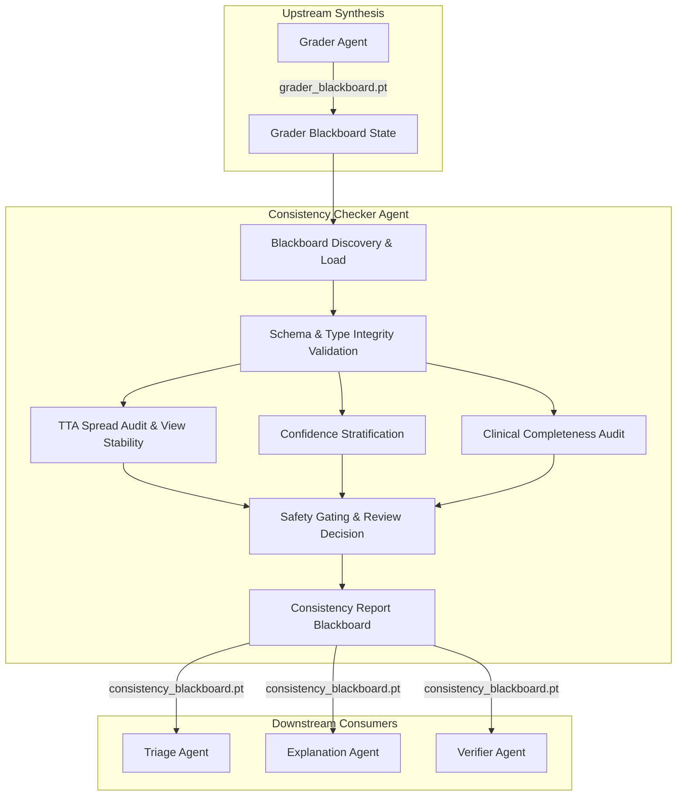

# 🔍 RetinaAgent — Consistency Checker Agent

[](https://pytorch.org/)
[]()
[]()
[]()

The **Consistency Checker Agent** is the clinical safety and verification component within the **RetinaAgent** diagnostic ecosystem. It acts as an automated validation guardrail that verifies diagnostic stability across Test-Time Augmentation (TTA) views, audits confidence thresholds, assesses clinical record completeness, and enforces human-in-the-loop ophthalmologist escalation policies.

---

## 📌 Architectural Flow & Multi-Agent Context

The Consistency Checker operates immediately after the **Grader Agent**, inspecting `grader_blackboard.pt` before diagnostic reports are passed to downstream referral triage and patient-facing explanation agents.



---

## 📥 Input Contract: Grader Blackboard (`grader_blackboard.pt`)

The Consistency Checker verifies and extracts the following contractual fields:

| Field | Type | Description |
| :--- | :--- | :--- |
| `grade` | `int` | Primary Diabetic Retinopathy severity grade ($0$–$4$) |
| `grade_label` | `str` | Clinical stage label (e.g., `"Severe NPDR"`) |
| `confidence` | `float` | Model diagnostic confidence score $[0.0, 1.0]$ |
| `tta_grades` | `list[int]` | Vector of $3$ predicted grades from augmented image views |
| `tta_confidences` | `list[float]` | Vector of $3$ confidence probabilities |
| `tta_spread` | `int` | Stored prediction divergence $\max(\text{TTA}) - \min(\text{TTA})$ |
| `clinical_missing_fields` | `list[str]` | List of unpopulated clinical referral fields |
| `fusion_status` | `str` | Synthesis status identifier |
| `fusion_method` | `str` | Method strategy metadata |

---

## 🛡️ Core Validation & Audit Rules

### 1. Test-Time Augmentation (TTA) Consistency Gate
The agent recalculates the spread across augmented inference runs and verifies agreement:
$$\Delta \text{Grade} = \max(\text{Grades}_{\text{TTA}}) - \min(\text{Grades}_{\text{TTA}})$$

- **`EXACT` Agreement**: All 3 views yield the identical grade ($\Delta \text{Grade} = 0$).
- **`WITHIN_ONE_GRADE` Agreement**: Minor view discrepancy $\Delta \text{Grade} = 1$.
- **`DISAGREEMENT` / `INCONSISTENT`**: $\Delta \text{Grade} > 1$, automatically setting `review_required = True`.

### 2. Confidence Stratification
Diagnostic confidence is categorized into actionable clinical trust tiers:
- **`HIGH`**: $\text{Confidence} \ge 0.70$
- **`MODERATE`**: $0.50 \le \text{Confidence} < 0.70$
- **`LOW`**: $\text{Confidence} < 0.50$

### 3. Clinical Metadata Completeness
Measures patient referral completeness across the $7$ core clinical dimensions:
- **`COMPLETE`**: $0$ missing fields.
- **`PARTIALLY_COMPLETE`**: $1$ to $6$ missing fields.
- **`LARGELY_MISSING`**: All $7$ referral fields missing.

---

## 📤 Output Schema (`consistency_blackboard.pt`)

The output is saved under `/kaggle/working/consistency_blackboard.pt` conforming to the schema:

| Key | Type | Description |
| :--- | :--- | :--- |
| `agent` | `str` | Identifier (`"ConsistencyCheckerAgent"`) |
| `grade` | `int` | Verified DR grade ($0$ to $4$) |
| `grade_label` | `str` | Verified clinical stage label |
| `confidence` | `float` | Diagnostic posterior probability |
| `tta_grades` | `list[int]` | Multi-view prediction grades |
| `tta_confidences` | `list[float]` | Multi-view confidence scores |
| `tta_spread` | `int` | Recalculated grade difference across views |
| `tta_consistent` | `bool` | `True` if $\Delta \text{Grade} \le 1$, else `False` |
| `consistency_status` | `str` | `"CONSISTENT"` or `"INCONSISTENT"` |
| `prediction_agreement` | `str` | `"EXACT"`, `"WITHIN_ONE_GRADE"`, or `"DISAGREEMENT"` |
| `confidence_status` | `str` | `"HIGH"`, `"MODERATE"`, or `"LOW"` |
| `clinical_missing_fields`| `list[str]` | List of unrecorded patient variables |
| `clinical_missing_count` | `int` | Total count of missing clinical fields |
| `clinical_completeness` | `str` | `"COMPLETE"`, `"PARTIALLY_COMPLETE"`, or `"LARGELY_MISSING"` |
| `fusion_status` | `str` | Traceable fusion metadata |
| `fusion_method` | `str` | Fusion method strategy description |
| `review_required` | `bool` | Flag indicating mandatory clinician audit |
| `review_reason` | `str \| None` | Explicit rationale for escalation |

---

## 🚀 Execution & Usage

### 1. Requirements
```bash
pip install torch
```

### 2. Running in Kaggle / Local Pipeline
The Consistency Checker Agent is packaged as [consistency-checker.ipynb](file:///c:/Users/divya/Desktop/minorproject/RetinaAgent/ConsitencyCheckerAgent/consistency-checker.ipynb):

```python
import torch

# Load Consistency Checker blackboard output
consistency_bb = torch.load("/kaggle/working/consistency_blackboard.pt", map_location="cpu")
report = consistency_bb["output"]

print(f"Verified Grade        : {report['grade']} ({report['grade_label']})")
print(f"Confidence Level      : {report['confidence']:.2%} [{report['confidence_status']}]")
print(f"TTA View Consistency  : {report['consistency_status']} ({report['prediction_agreement']})")
print(f"Clinical Completeness : {report['clinical_completeness']} ({report['clinical_missing_count']} missing)")
print(f"Ophthalmologist Review: {report['review_required']}")
if report["review_reason"]:
    print(f"Escalation Reason     : {report['review_reason']}")
```

---

## ⚖️ Clinical Safety Disclaimer
The Consistency Checker Agent is designed as a safety guardrail. Cases flagged with `review_required = True` or `consistency_status = "INCONSISTENT"` indicate diagnostic instability or significant missing clinical context and require mandatory verification by a licensed ophthalmologist prior to any clinical intervention.
