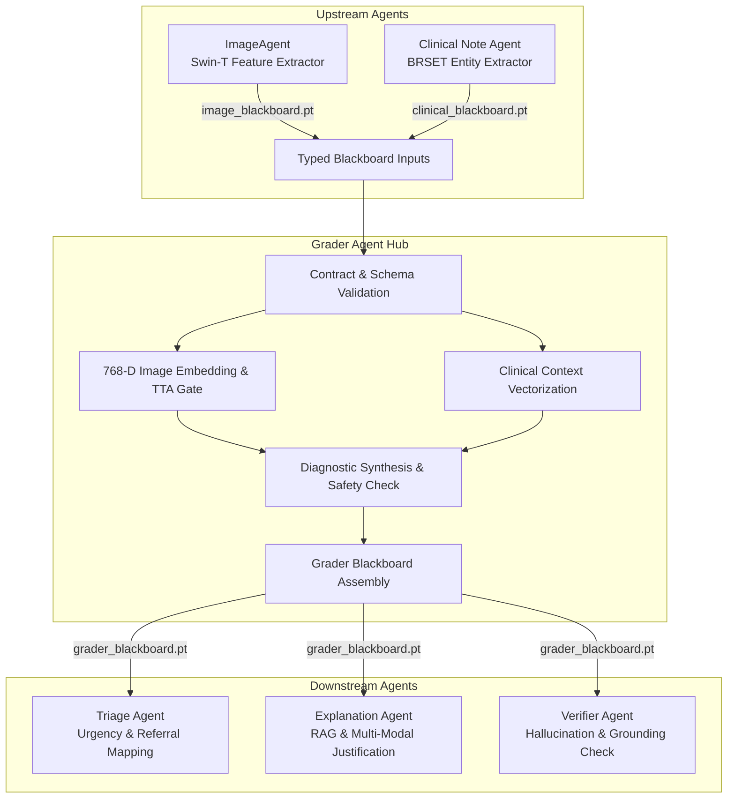

# 🩺 RetinaAgent — Grader Agent

[](https://pytorch.org/)
[](https://www.kaggle.com/work/collections/19217866)
[]()
[]()
[]()

> **Kaggle Collection:** [RetinaAgent Collection (19217866)](https://www.kaggle.com/work/collections/19217866)

The **Grader Agent** serves as the central diagnostic synthesis hub within the **RetinaAgent** pipeline. It bridges visual diagnostic evidence from the **ImageAgent** and structured patient metadata from the **Clinical Note Agent**, producing a unified diagnostic assessment and propagating explainability artifacts down the clinical decision pipeline.

---

## 📌 Architecture & Multi-Agent Flow

In accordance with the RetinaAgent blackboard / LangGraph architecture, individual agents do not invoke each other directly; instead, they consume and emit typed blackboard state artifacts (`*.pt`).



---

## 📥 Input Blackboard Contracts

### 1. `ImageAgent` Blackboard (`image_blackboard.pt`)
The Grader Agent verifies and extracts:
- `grade` (*int*): Predicted DR Grade ($0$–$4$) on the International Clinical Diabetic Retinopathy (ICDR) scale.
- `confidence` (*float*): Posterior class probability score.
- `image_embedding` (*torch.Tensor*): Dense $768$-dimensional latent feature vector from the Swin Transformer backbone.
- `gradcam` (*np.ndarray*): $(224, 224)$ normalized attention activation heatmap.
- `lesion_boxes` (*list[dict]*): Localized bounding boxes `[{x, y, width, height, area}, ...]`.
- `segmentation_mask` (*np.ndarray*): $(224, 224)$ continuous pixel-level lesion probability map.
- `tta_grades` & `tta_confidences` (*list*): Multi-view test-time augmentation predictions.
- `grade_range` (*int*) & `review_required` (*bool*): Visual consistency flags.

### 2. `Clinical Note Agent` Blackboard (`clinical_blackboard.pt`)
Structured clinical entities extracted from patient referral records:
- `image_id` (*str*): Unique case linkage identifier.
- `visual_acuity` (*dict*): Snellen / LogMAR measurements for right and left eyes (`None` if unrecorded).
- `lens_status`, `prior_laser`, `prior_anti_vegf`, `prior_vitrectomy` (*optional*): Past surgical/interventional history.
- `hba1c` (*float | None*): Glycated hemoglobin percentage.
- `diabetes_duration` (*float | None*): Duration of diagnosed diabetes in years.
- `symptoms` (*list*): Reported patient symptoms.
- `missing_fields` (*list[str]*): Explicit inventory of missing clinical values.

---

## 🔬 Key Mechanisms & Design Decisions

### 1. Anti-Fabrication & Evidence Grounding Policy
- **No Synthetic Clinical Pairs**: Unpaired image and clinical records are never artificially correlated by arbitrary row indexing.
- **No Untrained Fusion Heads**: Rather than routing multimodal tokens through a randomly initialized linear projection layer $W_f$, the Grader strictly grounds the primary severity grade in verified visual evidence while binding structured clinical entities as non-destructive contextual vectors.
- **Missing Field Transparency**: Missing clinical parameters remain explicitly `None` or flagged under `clinical_missing_fields` to prevent dangerous clinical hallucinations.

### 2. Clinical Context Encoding
The clinical record is converted into an $11$-dimensional context vector:
$$\mathbf{v}_{\text{clinical}} = \begin{bmatrix} \mathbb{I}(\text{VA}), \mathbb{I}(\text{Lens}), \mathbb{I}(\text{Laser}), \mathbb{I}(\text{Anti-VEGF}), \mathbb{I}(\text{HbA1c}), \hat{t}_{\text{DM}}, \mathbb{I}(\text{Vitrectomy}), \mathbb{I}(\text{Symptoms}), \mathbb{I}(\text{Quality}), \frac{|\text{Missing}|}{7}, \mathbb{I}(\text{ID}) \end{bmatrix}^T$$
where $\hat{t}_{\text{DM}} = \text{clip}\left(\frac{\text{duration}}{30}, 0, 1\right)$ normalizes disease duration.

### 3. Safety Gates & Multi-Factor Clinician Review
The case is automatically flagged for human-in-the-loop ophthalmologist review (`review_required = True`) when any of the following triggers are met:
1. **TTA Uncertainty Spread**: $\Delta \text{Grade}_{\text{TTA}} = \max(\text{TTA}) - \min(\text{TTA}) > 1$.
2. **Low Model Confidence**: Image classification confidence $p < 0.30$.
3. **Incomplete Clinical Context**: Presence of missing mandatory referral fields.

---

## 📤 Output Schema (`grader_blackboard.pt`)

The Grader Agent saves its output under `/kaggle/working/grader_blackboard.pt` conforming to the schema:

| Key | Type | Description |
| :--- | :--- | :--- |
| `agent` | `str` | Identifier (`"GraderAgent"`) |
| `grade` | `int` | Final DR severity grade (`0` to `4`) |
| `grade_label` | `str` | Clinical stage label (e.g., `"Moderate NPDR"`) |
| `confidence` | `float` | Diagnostic confidence score $[0.0, 1.0]$ |
| `image_agent_grade` | `int` | Grade directly inferred by vision agent |
| `image_agent_confidence` | `float` | Vision model confidence |
| `image_embedding` | `torch.Tensor` | $(768,)$-dim latent Swin-T embedding |
| `clinical_context_vector` | `torch.Tensor` | $(11,)$-dim normalized clinical state vector |
| `clinical_context` | `dict` | Key-value mapping of available clinical metadata |
| `clinical_missing_fields` | `list[str]` | List of unpopulated referral fields |
| `gradcam` | `np.ndarray` | Saliency attention map $(224, 224)$ |
| `lesion_boxes` | `list[dict]` | Detected lesion coordinates and pixel areas |
| `segmentation_mask` | `np.ndarray` | Semantic segmentation probability map $(224, 224)$ |
| `tta_grades` | `list[int]` | Multi-view prediction grades |
| `tta_confidences` | `list[float]` | Multi-view confidence scores |
| `tta_spread` | `int` | Prediction divergence across augmented views |
| `review_required` | `bool` | Mandatory clinical review flag |
| `review_reasons` | `list[str]` | Specific rationale items triggering review |
| `fusion_status` | `str` | Synthesis status (`"IMAGE_GROUNDED_NO_TRAINED_FUSION"`) |
| `fusion_method` | `str` | Method strategy (`"image_grade_with_clinical_context"`) |
| `image_id` | `str` | Linking identifier for case tracking |

---

## 🏷️ ICDR Severity Classification

| Grade | Clinical Label | Key Diagnostic Hallmark |
| :---: | :--- | :--- |
| **0** | **No DR** | No retinal abnormalities |
| **1** | **Mild NPDR** | Microaneurysms only |
| **2** | **Moderate NPDR** | Microaneurysms, dot/blot hemorrhages, hard exudates |
| **3** | **Severe NPDR** | 4-2-1 rule: $>20$ intraretinal hemorrhages in 4 quadrants, venous beading in $\ge 2$ quadrants, or IRMA in $\ge 1$ quadrant |
| **4** | **Proliferative DR** | Neovascularization (NVD/NVE) or preretinal/vitreous hemorrhage |

---

## 🚀 Execution & Usage

### 1. Requirements
```bash
pip install torch torchvision numpy
```

### 2. Running in Kaggle / Local Pipeline
The Grader Agent can be executed directly as a notebook ([grader-agent.ipynb](file:///c:/Users/divya/Desktop/minorproject/RetinaAgent/GraderAgent/grader-agent.ipynb)) or imported in modular pipelines:

```python
import torch

# Load Grader blackboard output
grader_bb = torch.load("/kaggle/working/grader_blackboard.pt", map_location="cpu")
result = grader_bb["output"]

print(f"Case ID          : {result['image_id']}")
print(f"Assigned Grade   : {result['grade']} ({result['grade_label']})")
print(f"Confidence       : {result['confidence']:.2%}")
print(f"Review Required  : {result['review_required']}")
if result["review_required"]:
    print(f"Review Reasons   : {result['review_reasons']}")
```

---

## 👥 Contributors

- **Divyanshu** ([@Divyanshu227](https://github.com/Divyanshu227))
- **Prem Shaw** ([@Premshaw23](https://github.com/Premshaw23))

---

## ⚖️ Clinical Disclaimer
The Grader Agent is intended for clinical decision support and research. It incorporates multi-criteria safety gates and Test-Time Augmentation consistency checks to detect diagnostic ambiguities; all recommendations must be reviewed and confirmed by licensed eye-care specialists.

