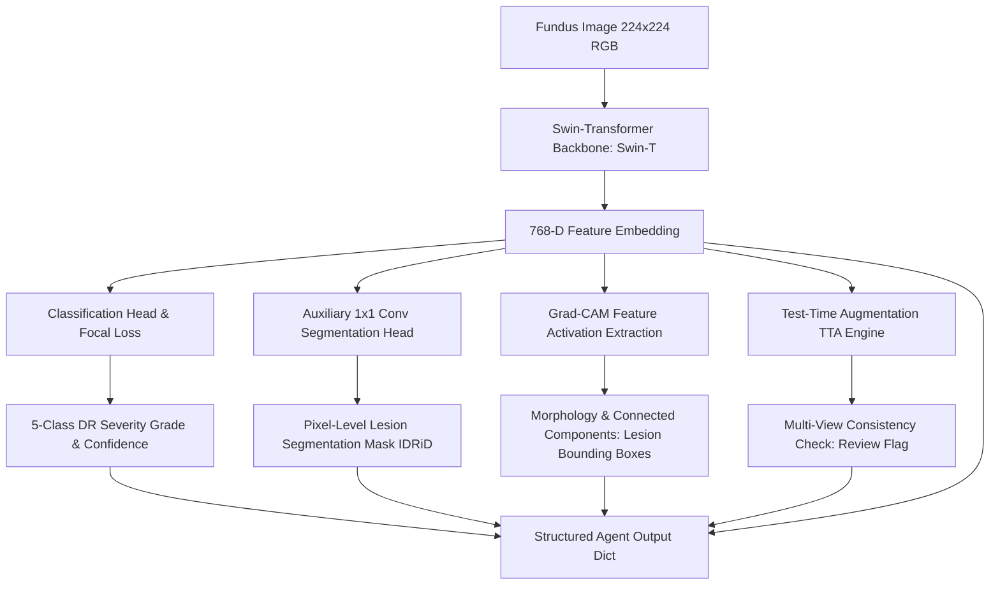

# 👁️ RetinaAgent: Autonomous Multi-Task Medical Vision Agent for Retinal Disease Diagnostics

[](https://pytorch.org/)
[](https://www.kaggle.com/work/collections/19217866)
[](https://github.com/huggingface/pytorch-image-models)
[]()
[]()

> **Kaggle Collection:** [RetinaAgent Collection (19217866)](https://www.kaggle.com/work/collections/19217866)

**RetinaAgent** is an intelligent, multi-task computer vision agent designed for automated grading, lesion segmentation, explainable localization, and uncertainty-aware clinical triage of **Diabetic Retinopathy (DR)** from digital fundus photography.

---

## 📌 Key Architectural Highlights



### 1. 🩻 Hierarchical Vision Transformer Backbone (Swin-T)
- Utilizes `swin_tiny_patch4_window7_224` pretrained on ImageNet-1K.
- Shifted window self-attention captures both fine micro-vascular anomalies and global retinal context with linear computational complexity.
- Generates rich $768$-dimensional latent spatial representations (`[B, 7, 7, 768]`).

### 2. 🎯 Class-Imbalance Resilient Classification (Focal Loss)
- Formulated with **Focal Loss** ($\alpha = 0.25, \gamma = 2.0$) to overcome severe class imbalance common in medical grading datasets:
  $$\mathcal{L}_{\text{Focal}} = -\alpha (1 - p_t)^\gamma \log(p_t)$$
- Predicts across standard clinical 5-stage International Clinical Diabetic Retinopathy (ICDR) scale:
  - `0`: No DR (Healthy retina)
  - `1`: Mild NPDR (Microaneurysms only)
  - `2`: Moderate NPDR (More than microaneurysms, but less than severe)
  - `3`: Severe NPDR (4-2-1 rule: hemorrhages, venous beading, IRMA)
  - `4`: Proliferative DR (PDR - Neovascularization or vitreous/preretinal hemorrhage)

### 3. 🔬 Multi-Task Lesion Segmentation Head
- Lightweight auxiliary $1 \times 1$ convolutional decoder attached directly to transformer feature outputs.
- Bilinearly upsampled to native $(224, 224)$ resolution.
- Supervised using binary cross-entropy on merged ground-truth masks from the **IDRiD (Indian Diabetic Retinopathy Image Dataset)**, isolating:
  - Microaneurysms (MA)
  - Haemorrhages (HE)
  - Hard Exudates (EX)
  - Soft Exudates / Cotton Wool Spots (SE)

### 4. 🔍 Explainability & Bounding Box Extraction
- **Grad-CAM Saliency Maps**: Backpropagates gradients with respect to target class logits to compute activation heatmaps over transformer token patches.
- **Morphological Component Analysis**: Applies Otsu/quantile filtering ($q = 0.50$), morphological opening & closing, and `cv2.connectedComponentsWithStats` to filter spurious artifacts ($area \ge 20\text{ px}$) and output structured bounding boxes `(x, y, width, height, area)` for clinical review.

### 5. 🛡️ Test-Time Augmentation (TTA) & Clinical Safety Guard
- Performs real-time inference on transformed views (original, horizontal flip, $10^\circ$ rotation).
- Measures diagnostic stability via prediction range:
  $$\Delta \text{Grade} = \max(\text{Grades}_{\text{TTA}}) - \min(\text{Grades}_{\text{TTA}})$$
- Automatically flags `review_required = True` when $\Delta \text{Grade} > 1$, acting as an automated escalation guardrail for borderline or ambiguous scans.

### 6. 🤖 Latent Embedding Export for Multi-Agent Workflows
- Computes mean-pooled 768-dimensional latent vector (`image_embedding`).
- Provides ready-to-use vector embeddings for downstream multimodal LLMs, patient memory agents, or vector databases (e.g., ChromaDB, Pinecone).

---

## 📂 Directory Structure

```text
RetinaAgent/
└── ImageAgent/
    ├── ImageAgent.ipynb          # Clean, modular end-to-end training and inference notebook
    ├── ImageAgentRawCode.ipynb   # Complete execution trace with dataset download & training artifacts
    └── README.md                 # Technical specification and documentation
```

---

## 📊 Agent Interface & Output Schema

The primary entry point `image_agent(image)` returns a structured Python dictionary:

```python
output = image_agent(image)
```

| Key | Type | Description |
| :--- | :--- | :--- |
| `grade` | `int` | Predicted DR grade (`0` to `4`) |
| `confidence` | `float` | Model confidence probability for the predicted grade |
| `image_embedding` | `torch.Tensor` | $(768,)$-dim global representation vector |
| `gradcam` | `np.ndarray` | $(224, 224)$ normalized attention heatmap |
| `lesion_boxes` | `list[dict]` | Detected lesion regions `[{x, y, width, height, area}, ...]` |
| `segmentation_mask` | `np.ndarray` | $(224, 224)$ continuous lesion probability map $[0.0, 1.0]$ |
| `tta_grades` | `list[int]` | Predicted grades across 3 augmented views |
| `tta_confidences` | `list[float]` | Confidences across 3 augmented views |
| `grade_range` | `int` | Maximum discrepancy across TTA views |
| `review_required` | `bool` | Safety flag: `True` if $\Delta \text{Grade} > 1$ |

---

## 🚀 Quickstart & Usage

### 1. Requirements
Ensure the following dependencies are installed:
```bash
pip install torch torchvision timm opencv-python pillow numpy pandas scikit-learn kagglehub
```

### 2. Loading & Running the Agent

```python
import torch
from torchvision import transforms
from PIL import Image

# Preprocessing transform
transform = transforms.Compose([
    transforms.Resize((224, 224)),
    transforms.ToTensor(),
    transforms.Normalize(mean=[0.485, 0.456, 0.406], std=[0.229, 0.224, 0.225])
])

# Load and preprocess sample fundus image
image = Image.open("path_to_fundus_image.png").convert("RGB")
tensor_image = transform(image)

# Run autonomous agent
result = image_agent(tensor_image)

print(f"Predicted Diagnosis Grade : {result['grade']}")
print(f"Confidence Score          : {result['confidence']:.2%}")
print(f"TTA Predictions           : {result['tta_grades']}")
print(f"Clinician Review Needed   : {result['review_required']}")
print(f"Localized Lesion Count    : {len(result['lesion_boxes'])}")
```

---

## 📚 Datasets Used

1. **APTOS 2019 Blindness Detection**:
   - Source: Kaggle / Asia Pacific Tele-Ophthalmology Society.
   - Purpose: Multi-class Diabetic Retinopathy severity grading benchmark.
2. **IDRiD (Indian Diabetic Retinopathy Image Dataset)**:
   - Source: IEEE Dataport / Kaggle.
   - Purpose: Pixel-level ground-truth annotations for Microaneurysms, Haemorrhages, Hard Exudates, and Soft Exudates.

---

## ⚖️ Clinical Disclaimer
This system is intended for research and educational purposes. While uncertainty bounds and TTA-based human-in-the-loop review triggers are implemented, all outputs should be verified by certified ophthalmologists prior to clinical intervention.
